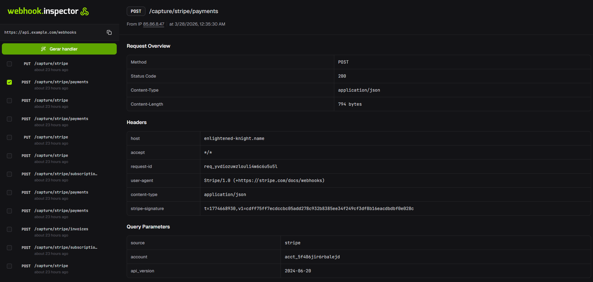

<div align="center">


# Webhook Inspector AI


<!---->

Aplicação full-stack para capturar, inspecionar e gerar handlers TypeScript para webhooks com apoio de IA.

[Visão geral](#visão-geral) · [Funcionalidades](#funcionalidades) · [Tecnologias](#tecnologias) · [Preview](#preview) · [Pré-requisitos](#pré-requisitos) · [Instalação](#instalação) · [Variáveis](#variáveis-de-ambiente) · [Como Rodar](#como-rodar) · [Scripts](#scripts) · [Estrutura](#estrutura-do-projeto)

</div>

---

## Visão Geral

O projeto é um monorepo com dois workspaces:

- `api`: backend em Fastify + Drizzle + PostgreSQL
- `web`: frontend em React + Vite + TanStack Router

## Funcionalidades

- Captura de webhooks em endpoint dedicado.
- Listagem paginada de webhooks capturados.
- Visualização de detalhes do webhook (overview, headers, query params e body).
- Exclusão de webhook.
- Seleção de múltiplos webhooks para gerar um handler TypeScript via IA.
- Documentação interativa da API em `/docs`.

## Tecnologias

### Backend (`api`)

- Fastify
- fastify-type-provider-zod
- Drizzle ORM + drizzle-zod
- PostgreSQL (`pg`)
- Zod
- AI SDK (`ai`) + Google provider (`@ai-sdk/google`)
- TypeScript + tsx

### Frontend (`web`)

- React 19
- Vite 8
- TanStack React Query
- TanStack Router
- Radix UI
- Tailwind CSS 4
- TypeScript

### Ferramentas

- pnpm (workspaces)
- Biome (formatação)
- Docker / Docker Compose (banco)

## Preview



## Pré-requisitos

- Node.js 20+
- pnpm 10+
- Docker e Docker Compose
- Chave de API do Google Generative AI

## Instalação

1. Instale as dependências na raiz:

```bash
pnpm install
```

2. Configure variáveis de ambiente da API:

```bash
cd api
cp .env.example .env
```

3. Configure variáveis de ambiente do frontend:

```bash
cd ../web
cp .env.example .env
```

4. Suba o PostgreSQL:

```bash
cd ../api
docker compose up -d
```

5. Gere e aplique migrações:

```bash
pnpm run db:generate
pnpm run db:migrate
```

## Variáveis de Ambiente

### API (`api/.env`)

- `NODE_ENV` (default: `development`)
- `PORT` (default: `3333`)
- `DATABASE_URL` (obrigatoria)
- `GOOGLE_GENERATIVE_AI_API_KEY` (obrigatoria)

Exemplo em `api/.env.example`.

### Web (`web/.env`)

- `VITE_API_URL` (ex.: `http://localhost:3333`)

Exemplo em `web/.env.example`.

## Como Rodar

### Desenvolvimento

Terminal 1 (API):

```bash
cd api
pnpm run dev
```

Terminal 2 (Web):

```bash
cd web
pnpm run dev
```

## Scripts

### API (`api/package.json`)

- `pnpm run dev`: inicia API com hot reload
- `pnpm run start`: executa build da API (dist)
- `pnpm run format`: formata código com Biome
- `pnpm run db:generate`: gera migrações Drizzle
- `pnpm run db:migrate`: aplica migrações
- `pnpm run db:studio`: abre Drizzle Studio
- `pnpm run db:seed`: popula dados de exemplo

### Web (`web/package.json`)

- `pnpm run dev`: inicia frontend
- `pnpm run build`: build de producao
- `pnpm run preview`: preview do build
- `pnpm run format`: formata código com Biome

### Monorepo (raiz)

- `pnpm install`: instala dependências de todos os workspaces
- `pnpm -r run build`: executa build em todos os workspaces

## Endereços Locais

- Frontend: `http://localhost:5173`
- API: `http://localhost:3333`
- API Docs: `http://localhost:3333/docs`
- PostgreSQL: `localhost:5432`

## Estrutura do Projeto

```text
.
├── api/
│   ├── src/
│   │   ├── db/
│   │   ├── routes/
│   │   ├── env.ts
│   │   └── server.ts
│   ├── drizzle.config.ts
│   └── docker-compose.yml
├── web/
│   ├── src/
│   │   ├── components/
│   │   ├── http/
│   │   ├── routes/
│   │   └── main.tsx
│   ├── .env.example
│   └── vite.config.ts
└── pnpm-workspace.yaml
```

## Observações

- Não há test runner configurado no momento.
- Se alterar arquivos `.env`, reinicie os servidores de desenvolvimento.
